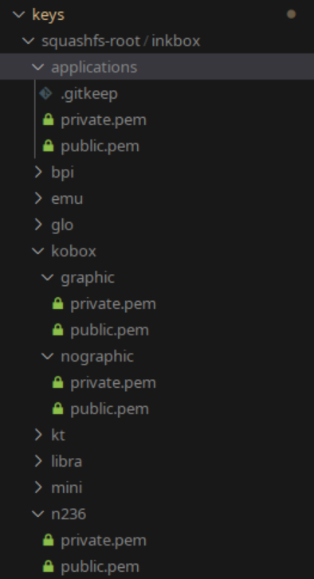

First, if you cloned this repo to an other path than `/home/build/qos/` go to load_qos_scripts.sh and edit QOS_REPO_PATHS to your needs.

Then, to load all these commands ( and functions... ) to your PATH run:
```
source load_qos_scripts.sh
```
run all these commands with `source` or `. command`

to customise the settings (ip address of qos, username, password, etc) execute `create_personal_values.sh`. From now on values will be loaded from `local_qos_settings.ini`

On first connection, connect to the device manually for fingerprint ssh fun. If you are using many qos devices, consider doing this horrible thing. In `~/.ssh/config` put:
```
Host *
    StrictHostKeyChecking no
    UserKnownHostsFile=/dev/null
```

If your system doesn't request DHCP on the usbnet automatically, use `nmtui` and in the interface name set the MAC address from `remote_functions.sh` file. You will find it.

to make all commands work without issues, run `prepare_qos` to set some flags. The device will be rebooted

If a command is needed and you don't have it, you will be promptet to install it. **If you are missing rust (the `cargo` command too)** you need to install it manually. That's because there are many ways to install it (remote script, package manager). **Also make sure docker is working and running**, `docker run hello-world` needs to succed (so you propably need to add your user to the docker group )

## Keys
keys will be generated automatically in `keys/tmp/`. If you want to provide existing ones, do it in:
- `keys/squashfs-root/qos/device-id-like-n306/private.pem` and public.pem in the same directory for device specific key
- `keys/squashfs-root/applications/` for user apps
- `keys/squashfs-root/kobox/`: `graphic` dir and `nographic` dir

TLDR:
